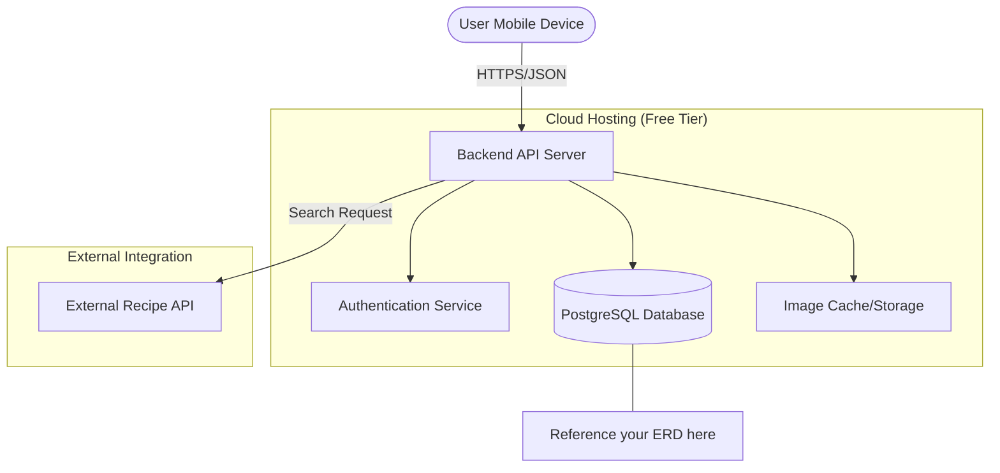

```mermaid
graph TD
    User([User Mobile Device]) -- HTTPS/JSON --> API[Backend API Server]

    subgraph "Cloud Hosting (Free Tier)"
        API --> Auth[Authentication Service]
        API --> DB[(PostgreSQL Database)]
        API --> Cache[Image Cache/Storage]
    end

    subgraph "External Integration"
        API -- Search Request --> RecipeAPI[External Recipe API]
    end

    DB --- ERD[Reference your ERD here]
```
