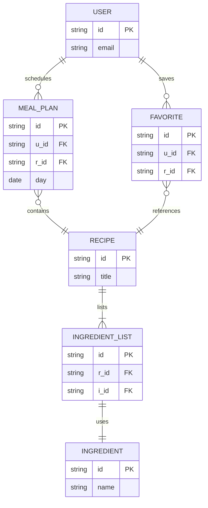

```mermaid
    erDiagram
USER ||--o{ MEAL_PLAN : "schedules"
USER ||--o{ FAVORITE : "saves"

    MEAL_PLAN }o--|| RECIPE : "contains"
    FAVORITE }o--|| RECIPE : "references"

    RECIPE ||--|{ INGREDIENT_LIST : "lists"
    INGREDIENT_LIST ||--|| INGREDIENT : "uses"

    USER {
        string id PK
        string email
    }
    MEAL_PLAN {
        string id PK
        string u_id FK
        string r_id FK
        date day
    }
    FAVORITE {
        string id PK
        string u_id FK
        string r_id FK
    }
    RECIPE {
        string id PK
        string title
    }
    INGREDIENT_LIST {
        string id PK
        string r_id FK
        string i_id FK
    }
    INGREDIENT {
        string id PK
        string name
    }
```
