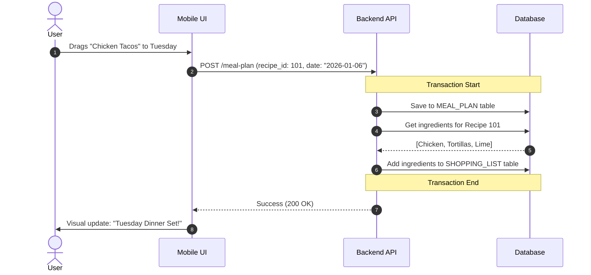

```mermaid
sequenceDiagram
    autonumber
    actor User
    participant App as Mobile UI
    participant Server as Backend API
    participant DB as Database

    User->>App: Drags "Chicken Tacos" to Tuesday
    App->>Server: POST /meal-plan (recipe_id: 101, date: "2026-01-06")

    Note over Server, DB: Transaction Start
    Server->>DB: Save to MEAL_PLAN table
    Server->>DB: Get ingredients for Recipe 101
    DB-->>Server: [Chicken, Tortillas, Lime]

    Server->>DB: Add ingredients to SHOPPING_LIST table
    Note over Server, DB: Transaction End

    Server-->>App: Success (200 OK)
    App->>User: Visual update: "Tuesday Dinner Set!"
```
